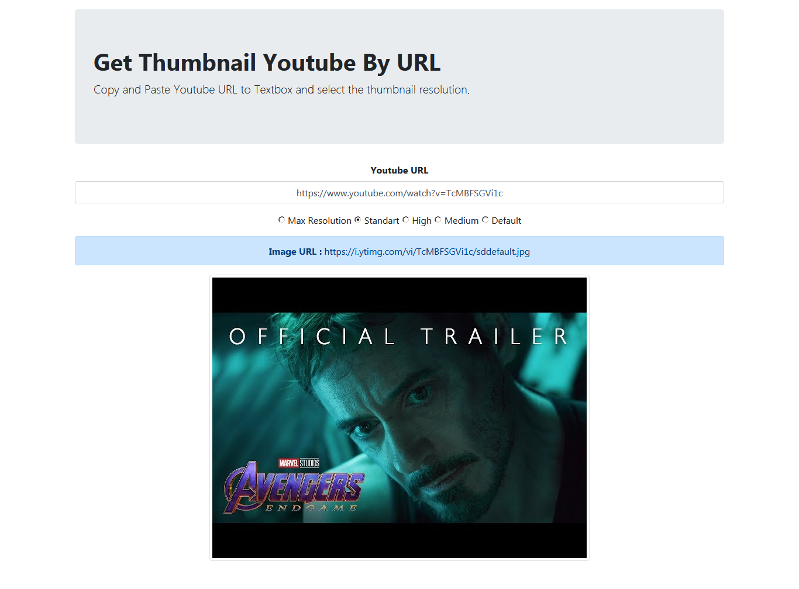

# [Get Thumbnail Youtube By URL](https://djuliar.github.io/get-youtube-thumbnail/)
Copy and Paste Youtube URL to Textbox and select the thumbnail resolution.

# Usage
Open the youtube page and copy the URL in your browser's address bar, You can use any type of youtube URL style like:
- https://www.youtube.com/watch?v=XXX
- https://youtu.be/XXX
- https://www.youtube.com/embed/XXX
